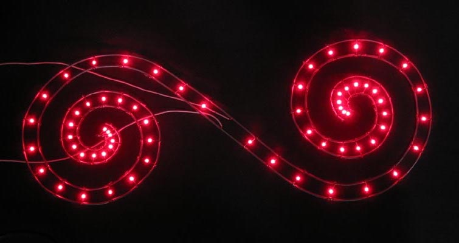

# Pulsar
Pulsar is a project to animate a single LED or other light source (e.g., an electroluminescent wire). For the first part of this project only the brightness changes are part of the animations.

## Inspiration
It is inspired by two different sets of LEDs. The most recent is a string of blue LEDs with a USB connection on the end. As expected, these are all on when plugged in. I wanted to make it more interesting. Many years ago I had the idea of creating a set of spirals covered with LEDs, so I soldered over 60 LEDs in parallel between two wires.

## Goals
* Time-based animations: The animation speed should not depend on how often the animation routines are called. Instead, the animations will use the current time (milliseconds) to determine the brightness.
* Light hardware abstraction: The animations routines should not talk to the hardware directly. Instead, a "SinglePixel" class, with a "setBrightness" function, will be provided to the animation. Subclasses of the SinglePixel class will handle updating hardware. 

## Architecture

### SinglePixel class

### Animation routine

## Examples

### 01
Runs each animation for about 30 seconds and advances to the next. Uses an analog pin to control the LED.

## Next Steps
* Add setHue; called from run loop to advance through colors, either with each animation change or continually
* Add setBrightnessAndHue
* Add setColor
* Map brightness to hue
* Use brightness to select between two colors.
* Map brightness to distance along addressable pixel strip
* Demonstrate different animations running independently on different pins
